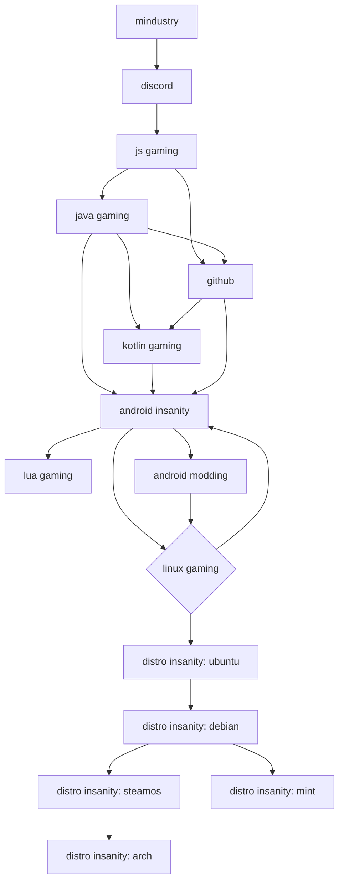

  
Gaming/Insanity

  

```mermaid
graph TD
  A[js gaming] --> B[java gaming]
  B --> C[android insanity]
  B --> D[kotlin gaming]
  C --> E[lua gaming]
  C --> F{linux gaming}
  D --> C
  C --> G[android modding]
  G --> F
  F --> H[distro insanity: ubuntu]
  H --> I[distro insanity: debian]
  I --> J[distro insanity: steamos]
  I --> K[distro insanity: mint]
  J --> L[distro insanity: arch]
  F --> C
  M[mindustry] --> N[discord]
  A --> O[github]
  B --> O
  O --> C
  O --> D
  N --> A
```

  
Stats

